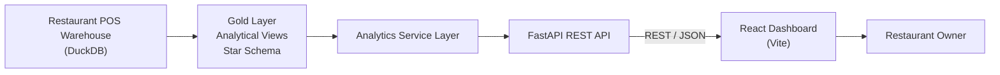
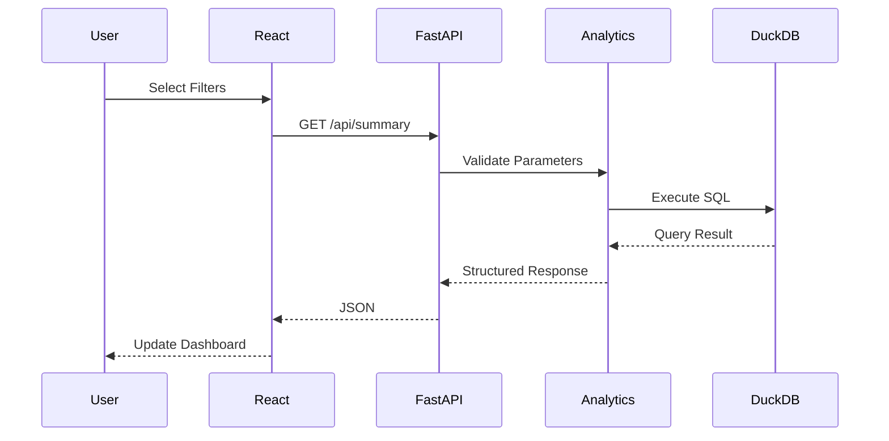
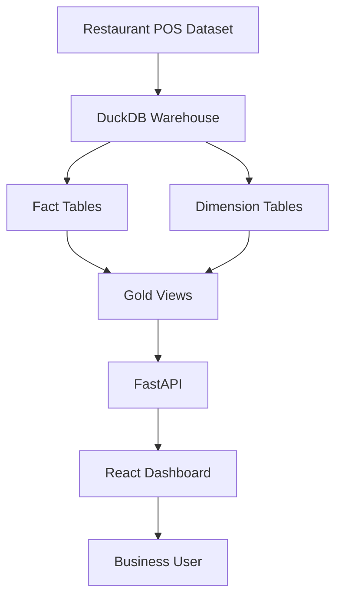

<div align="center">

# 🍽️ Restaurant POS Analytics Dashboard

### Full-Stack Restaurant Analytics Platform built with React, FastAPI & DuckDB

A production-style analytics dashboard that serves restaurant Point-of-Sale (POS) data directly from a DuckDB analytics warehouse through a FastAPI REST API to an interactive React dashboard.

Designed as a lightweight analytics serving layer with real-time SQL queries, interactive filtering, and a clean separation between presentation, API, and data layers.

---


</div>

---

## 🌐 Live Demo

| Resource | Link |
|----------|------|
| 🚀 Live Dashboard | https://task-2-six-sable.vercel.app |
| 🔗 Backend API | https://restaurant-pos-api-3nz8.onrender.com |
| 📘 Swagger Documentation | https://restaurant-pos-api-3nz8.onrender.com/docs |
---

## 📌 Overview

Restaurant POS Analytics Dashboard is a full-stack business intelligence application developed to expose analytical insights from an existing Restaurant POS data warehouse.

Instead of embedding business logic inside the frontend, the application follows a **thin serving layer architecture**:

- **React** provides the presentation layer.
- **FastAPI** exposes analytical REST endpoints.
- **DuckDB** acts as the analytical warehouse.
- **SQL** computes metrics on demand.
- **Interactive filters** trigger real backend queries instead of client-side filtering.

The deployed application uses a **schema-compatible synthetic DuckDB warehouse**, allowing the complete system to be publicly demonstrated without exposing confidential restaurant data.

---

## ✨ Key Highlights

- Full-stack analytics application
- Real SQL-powered analytics (no mocked responses)
- FastAPI REST API with parameterized queries
- React dashboard with interactive visualizations
- DuckDB analytical warehouse
- Star schema data model
- Gold-layer analytical views
- Dynamic filtering (Date, Brand, Platform)
- Responsive dashboard
- Public deployment using Vercel & Render
- Environment-driven configuration
- Production-style project structure

---

# 🏗️ System Architecture

The application follows a layered architecture where each component has a single responsibility.

- **React** handles presentation.
- **FastAPI** exposes business analytics through REST APIs.
- **DuckDB** serves as the analytical warehouse.
- **SQL** performs on-demand aggregation.
- **Environment variables** isolate configuration from implementation.



---

# 🔄 Request Lifecycle

Every dashboard interaction triggers a real backend request.

No dashboard metrics are preloaded or hardcoded.



---

# 📊 Data Flow



---

# ⚙️ Technology Stack

| Layer | Technology | Purpose |
|---------|------------|---------|
| Frontend | React 18 | User Interface |
| Build Tool | Vite | Fast Development & Build |
| Routing | React Router | Client-side Navigation |
| Charts | Recharts | Data Visualization |
| HTTP Client | Axios | API Communication |
| Backend | FastAPI | REST API |
| Validation | Pydantic | Request & Response Models |
| ASGI Server | Uvicorn | FastAPI Runtime |
| Database | DuckDB | Analytical Data Warehouse |
| Data Processing | Pandas | Result Transformation |
| Deployment | Vercel | Frontend Hosting |
| Deployment | Render | Backend Hosting |
| Version Control | Git & GitHub | Source Code Management |

---

# 🎯 Design Principles

The project was designed around a small number of engineering principles.

### Thin Serving Layer

The backend performs only request validation, SQL execution and response serialization.

Business metrics remain inside the analytical warehouse.

---

### Separation of Concerns

Each layer has a clearly defined responsibility.

| Layer | Responsibility |
|--------|---------------|
| React | Presentation |
| FastAPI | API Layer |
| Service Layer | SQL Generation |
| DuckDB | Analytics Engine |

---

### Read-only Analytics

The backend never modifies warehouse data.

All endpoints execute read-only analytical queries.

---

### Parameterized SQL

Every analytical query is executed using parameterized SQL to prevent SQL injection and to keep query generation predictable.

---

### Environment-driven Configuration

Configuration such as database location, API URL and deployment settings are provided through environment variables rather than being hardcoded.

---

### Synthetic Public Dataset

The deployed application uses a schema-compatible synthetic DuckDB warehouse, allowing the project to be demonstrated publicly while protecting real restaurant business data.

---

# 🚀 Features

The dashboard provides interactive analytical insights over the Restaurant POS warehouse through a lightweight REST API. Every visualization is backed by real SQL queries executed on demand.

| Feature | Description |
|----------|-------------|
| 📊 Executive Dashboard | Consolidated view of restaurant sales and operational KPIs |
| 💰 Sales Summary | Gross Sales, Orders, Average Order Value, Tax and Discount |
| 📈 Daily Sales Trend | Daily sales and order trends over the selected period |
| 🛒 Platform Performance | Compare Swiggy, Zomato and other ordering platforms |
| 🏪 Brand Performance | Analyze sales contribution across restaurant brands |
| 🎛 Interactive Filters | Filter analytics by Date Range, Brand and Platform |
| 🔄 Live Data Queries | Every filter triggers a new backend SQL query |
| ⚡ Fast Analytics | DuckDB analytical engine with optimized warehouse queries |
| 🌐 REST API | Clean FastAPI endpoints serving structured JSON responses |
| 📱 Responsive Dashboard | Optimized for desktop, tablet and mobile devices |
| 🔒 Secure Querying | Parameterized SQL queries with request validation |
| 🚀 Cloud Deployment | Frontend on Vercel and Backend on Render |

---

# 📂 Project Structure

```text
Task_2
│
├── backend
│   ├── app
│   │   ├── api
│   │   ├── core
│   │   ├── db
│   │   ├── schemas
│   │   ├── services
│   │   └── main.py
│   └── requirements.txt
│
├── frontend
│   ├── src
│   │   ├── assets
│   │   ├── components
│   │   ├── hooks
│   │   ├── layouts
│   │   ├── pages
│   │   ├── services
│   │   ├── styles
│   │   ├── utils
│   │   └── main.jsx
│   ├── package.json
│   └── vite.config.js
│
├── synthetic_data
│   ├── create_synthetic_database.py
│   └── restaurant_pos_synthetic.duckdb
│
├── docs
├── scripts
├── assignment.md
└── README.md
```

---

# 🧩 Backend Architecture

```text
FastAPI
│
├── API Layer
│      │
│      ▼
├── Service Layer
│      │
│      ▼
├── Database Layer
│      │
│      ▼
└── DuckDB Warehouse
```

### Responsibilities

| Layer | Responsibility |
|--------|---------------|
| API | Request validation, routing and HTTP responses |
| Services | Business logic and analytical SQL generation |
| Database | Read-only DuckDB connection management |
| Schemas | Typed request and response models using Pydantic |

---

# 🎨 Frontend Architecture

```text
React
│
├── Dashboard
│
├── Layouts
│
├── Components
│
├── Hooks
│
├── Services
│
└── Utilities
```

### Responsibilities

| Module | Purpose |
|---------|----------|
| Dashboard | Coordinates the analytics page |
| Components | KPI cards, charts, filters and reusable UI |
| Hooks | Data fetching and state management |
| Services | Axios client and API communication |
| Utilities | Formatting helpers and reusable functions |

---

# 📊 Dashboard Modules

The application is organized into a set of focused analytical sections.

| Module | Description |
|---------|-------------|
| Summary KPIs | High-level business metrics |
| Daily Sales | Daily sales and order trend |
| Platform Performance | Platform comparison |
| Brand Performance | Brand comparison |
| Filter Toolbar | Dynamic filtering across all widgets |

All dashboard widgets remain synchronized with the selected filters, ensuring a consistent analytical view.

---

# 🔍 Interactive Filtering

The dashboard supports server-side analytical filtering.

Available filters include:

- Date Range
- Platform
- Brand

Whenever a filter changes:

1. React updates the filter state.
2. Query parameters are generated.
3. FastAPI receives a new request.
4. DuckDB executes a parameterized SQL query.
5. Updated analytics are returned.
6. Charts and KPI cards refresh automatically.

No client-side filtering of preloaded datasets is performed.

---

# ⭐ Project Highlights

- Full-stack analytical application
- Modern React + FastAPI architecture
- Real-time SQL-powered dashboard
- DuckDB analytical warehouse
- Star schema data model
- Gold-layer reporting views
- Interactive filtering
- RESTful API design
- Clean separation of concerns
- Environment-based configuration
- Synthetic dataset for safe public deployment
- Production-style repository organization

---

# ⚡ Quick Start

## Prerequisites

Before running the project, ensure the following software is installed.

| Requirement | Version |
|-------------|---------|
| Python | 3.11+ |
| Node.js | 18+ |
| npm | Latest |
| Git | Latest |

---

# 🔧 Backend Setup

Clone the repository.

```bash
git clone <repository-url>
cd Task_2
```

Create a virtual environment.

```bash
cd backend

python -m venv .venv

# macOS / Linux
source .venv/bin/activate

# Windows
.venv\Scripts\activate
```

Install dependencies.

```bash
pip install -r requirements.txt
```

Create environment variables.

```bash
cp .env.example .env
```

Update

```env
DATABASE_PATH=../synthetic_data/restaurant_pos_synthetic.duckdb
HOST=0.0.0.0
PORT=8000
APP_ENV=development
```

Run the backend.

```bash
uvicorn app.main:app --reload
```

Backend

```
http://localhost:8000
```

Swagger

```
http://localhost:8000/docs
```

---

# 🎨 Frontend Setup

Navigate to the frontend.

```bash
cd frontend
```

Install dependencies.

```bash
npm install
```

Create environment variables.

```bash
cp .env.example .env
```

Configure the API URL.

```env
VITE_API_BASE_URL=http://localhost:8000
```

Run the application.

```bash
npm run dev
```

Frontend

```
http://localhost:5173
```

---

# 🌐 API Overview

The backend exposes a lightweight REST API over the analytics warehouse.

| Endpoint | Method | Description |
|-----------|--------|-------------|
| `/health` | GET | Health check |
| `/api/summary` | GET | Dashboard KPI summary |
| `/api/daily-sales` | GET | Daily sales analytics |
| `/api/platform-performance` | GET | Platform comparison |
| `/api/brand-performance` | GET | Brand comparison |
| `/api/filters` | GET | Available dashboard filters |

Interactive API documentation is available at:

```
/docs
```

---

# 📊 Query Parameters

Analytical endpoints support server-side filtering.

| Parameter | Description |
|-----------|-------------|
| `start_date` | Start of date range |
| `end_date` | End of date range |
| `platform` | Platform filter |
| `brand` | Brand filter |

Example

```http
GET /api/summary?start_date=2026-05-01&end_date=2026-05-31&platform=Swiggy&brand=Pizza Hut
```

Every request executes a fresh parameterized SQL query against DuckDB.

---

# 🗄️ Database Overview

The application follows a Star Schema warehouse design.

### Fact Tables

- fact_orders
- fact_order_items
- fact_kitchen

### Dimension Tables

- dim_date
- dim_brand
- dim_platform
- dim_restaurant
- dim_category
- dim_item

### Analytical Views

The warehouse also contains pre-aggregated analytical views used to simplify reporting and improve query organization.

Examples include:

- vw_daily_sales
- vw_platform_performance
- vw_brand_performance
- vw_kitchen_performance
- vw_order_status_analysis
- vw_discount_analysis
- vw_charge_analysis

Additional analytical views are included within the warehouse for reporting purposes.

---

# ☁️ Deployment

The application is deployed as two independent services.

| Component | Platform |
|------------|----------|
| Frontend | Vercel |
| Backend | Render |
| Database | DuckDB |

Deployment configuration is environment-driven.

The backend can point to any schema-compatible warehouse simply by updating the `DATABASE_PATH` environment variable.

The public deployment uses a synthetic warehouse that mirrors the production schema while protecting sensitive business information.

---

# 📸 Screenshots

> Screenshots will be added here.

Suggested screenshots:

- Dashboard Overview
- KPI Cards
- Platform Performance
- Brand Performance
- Daily Sales Trend
- Filter Toolbar
- Swagger UI
- Mobile Responsive Layout

---

# 📚 Project Documentation

Detailed documentation is available in the `docs/` directory.

| Document | Description |
|-----------|-------------|
| Architecture | Overall system architecture and request flow |
| Database | Star schema and warehouse documentation |
| API | Endpoint reference |
| Deployment | Deployment guide |
| Setup | Local development guide |

---

# 🛣️ Roadmap

Potential future enhancements include:

- Authentication & Role-Based Access Control
- API Response Caching
- Docker & Docker Compose Support
- Automated Testing Suite
- CI/CD Pipeline
- Advanced Dashboard Modules
- Export Reports (PDF/Excel)
- Scheduled Data Refresh
- Enhanced Monitoring & Logging

---

# 🤝 Contributing

Contributions are welcome.

If you discover a bug or have suggestions for improvement, please open an issue or submit a pull request following the existing project structure and coding standards.

---

<div align="center">

### ⭐ If you found this project useful, consider giving it a star.

Built using **React • FastAPI • DuckDB**

</div>