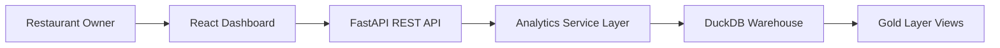
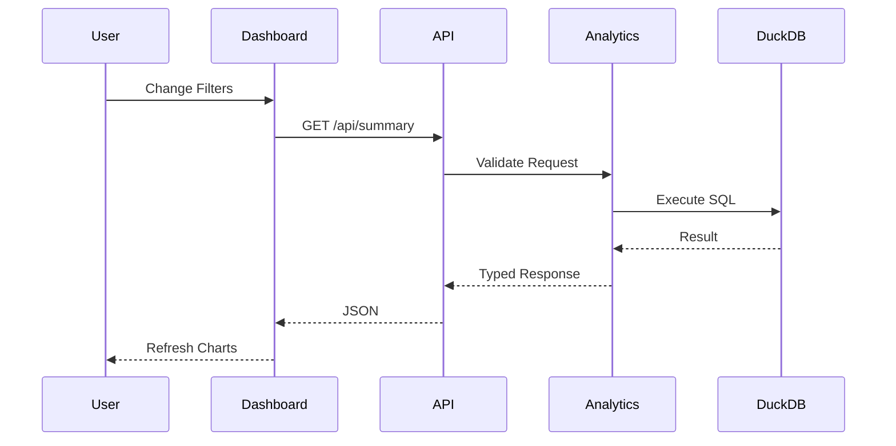

# System Architecture

## Overview

The Restaurant POS Analytics Dashboard is a full-stack analytics application designed as a lightweight serving layer over an existing Restaurant POS analytical warehouse.

Rather than embedding business logic inside the frontend, the application follows a layered architecture where each layer is responsible for a single concern.

- **React** provides the presentation layer.
- **FastAPI** exposes RESTful analytical endpoints.
- **DuckDB** serves as the analytical warehouse.
- **SQL** performs all analytical computations.
- **Environment variables** isolate runtime configuration from implementation.

The architecture prioritizes separation of concerns, maintainability, portability and straightforward deployment.

---

# Architecture Principles

The project was designed around several core software engineering principles.

## Thin Serving Layer

The backend acts as a serving layer over the analytical warehouse.

It validates requests, executes parameterized SQL queries, and returns structured JSON responses without duplicating business logic.

---

## Separation of Concerns

Each layer has a clearly defined responsibility.

| Layer | Responsibility |
|--------|---------------|
| React | User Interface |
| FastAPI | REST API |
| Service Layer | Analytical SQL |
| DuckDB | Data Warehouse |

Each component communicates only with the layer immediately beneath it.

---

## Read-Only Analytics

The application never modifies warehouse data.

All endpoints execute read-only analytical queries against the DuckDB warehouse.

This guarantees that the dashboard cannot accidentally alter business data.

---

## Environment Driven Configuration

Database locations, API URLs and deployment settings are provided through environment variables rather than being hardcoded into the application.

This allows the same codebase to run against:

- Local synthetic warehouse
- Production warehouse
- Any compatible warehouse sharing the same schema

without requiring code changes.

---

# Overall System Architecture



---

# Layer Responsibilities

## Presentation Layer

Technology

- React
- Vite
- Axios
- Recharts

Responsibilities

- Dashboard rendering
- KPI cards
- Charts
- Filter controls
- API communication
- Responsive layout

The frontend contains no analytical SQL or business calculations.

Every visualization is populated through backend API responses.

---

## API Layer

Technology

- FastAPI
- Uvicorn
- Pydantic

Responsibilities

- Request routing
- Input validation
- Response serialization
- Error handling
- HTTP status management

The API acts as the contract between the frontend and analytical warehouse.

---

## Service Layer

Responsibilities

- SQL generation
- Analytical query execution
- Parameter binding
- Data transformation
- Warehouse abstraction

This layer isolates database implementation details from the REST API.

---

## Database Layer

Technology

DuckDB

Responsibilities

- Warehouse storage
- Analytical execution
- Aggregations
- Star schema relationships
- Gold analytical views

The backend communicates exclusively with the warehouse through parameterized SQL queries.

---

# Backend Architecture

```mermaid
flowchart TD

Request

↓

FastAPI Router

↓

Validation

↓

Analytics Service

↓

DuckDB Connection

↓

SQL Execution

↓

JSON Response
```

---

## Request Flow

1. Client sends an HTTP request.

2. FastAPI routes the request to the appropriate endpoint.

3. Input parameters are validated.

4. The request is forwarded to the analytics service.

5. Parameterized SQL is generated.

6. DuckDB executes the query.

7. Results are transformed into typed response models.

8. JSON is returned to the client.

---

# Frontend Architecture

```mermaid
flowchart TD

Dashboard

↓

Hooks

↓

Axios Services

↓

FastAPI

↓

Dashboard State

↓

Charts & KPI Cards
```

The frontend follows a component-based architecture where data-fetching logic is separated from presentation components through reusable React hooks.

---

# Dashboard Data Flow



Every dashboard interaction triggers a fresh backend request.

No client-side filtering of preloaded datasets is performed.

---

# Configuration Flow

```mermaid
flowchart LR

Environment Variables

↓

Backend Configuration

↓

DuckDB Connection

↓

Analytics Service

↓

REST API

↓

Frontend
```

Runtime configuration is entirely environment-driven.

This enables the application to switch between different warehouses and deployment environments without modifying application code.

---

# Design Decisions

## Why React?

React provides a modular component architecture that enables reusable dashboard widgets, efficient rendering and clean separation between presentation and data-fetching logic.

---

## Why FastAPI?

FastAPI offers automatic request validation, OpenAPI documentation, high performance and straightforward integration with Python-based analytical workflows.

---

## Why DuckDB?

DuckDB is well suited for analytical workloads over columnar data, making it an excellent choice for serving business intelligence dashboards without requiring a separate database server.

---

## Why a Star Schema?

The warehouse follows a dimensional model that simplifies analytical queries and enables efficient aggregation across multiple business dimensions such as date, platform and brand.

---

## Why Parameterized SQL?

Parameterized queries improve security, prevent SQL injection and allow analytical filters to be safely applied without constructing SQL through string interpolation.

---

# Scalability Considerations

Although designed for a lightweight analytical workload, the architecture allows individual layers to evolve independently.

Examples include:

- Replacing DuckDB with another SQL-compatible warehouse.
- Deploying multiple FastAPI instances behind a load balancer.
- Introducing response caching for frequently requested analytics.
- Expanding the REST API with additional reporting endpoints.
- Adding authentication and authorization without affecting the presentation layer.

---

# Security Considerations

The current implementation follows several security best practices.

- Read-only database access.
- Parameterized SQL queries.
- Environment-based configuration.
- Typed request validation using Pydantic.
- Restricted Cross-Origin Resource Sharing (CORS).
- No sensitive production data exposed through the public deployment.

The publicly deployed application uses a schema-compatible synthetic warehouse to demonstrate the system while protecting confidential restaurant business information.