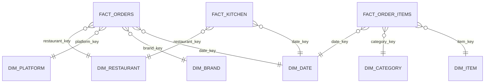
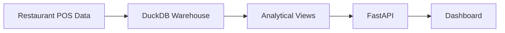

# Database Architecture

## Overview

The Restaurant POS Analytics Dashboard is built on top of an analytical DuckDB warehouse designed using a dimensional **Star Schema**. The warehouse stores transactional restaurant POS data in fact tables and descriptive business entities in dimension tables.

The dashboard never communicates with raw source files. Every analytical request is executed against the warehouse through parameterized SQL queries exposed by the FastAPI backend.

The warehouse consists of:

- Fact Tables
- Dimension Tables
- Gold Analytical Views

This architecture provides efficient analytical querying while maintaining a clear separation between transactional data and business dimensions.

---

# Database Architecture

```mermaid
flowchart TD

CSV["Restaurant POS Dataset"]

↓

Warehouse["DuckDB Warehouse"]

↓

Fact["Fact Tables"]

↓

Views["Gold Analytical Views"]

↓

FastAPI

↓

React Dashboard
```

The warehouse acts as the single source of truth for all analytical calculations.

---

# Star Schema

The warehouse follows a Star Schema where multiple dimension tables surround central fact tables.



The dimensional model simplifies analytical queries while minimizing data duplication.

---

# Warehouse Components

| Component | Purpose |
|------------|---------|
| Fact Tables | Store measurable business events |
| Dimension Tables | Store descriptive business attributes |
| Gold Views | Predefined analytical queries for reporting |

---

# Fact Tables

Fact tables store measurable business transactions.

---

## fact_orders

Primary analytical table for restaurant orders.

### Purpose

Stores order-level business metrics.

### Example Measures

- Gross Sales
- Tax
- Discount
- Delivery Charges
- Service Charges
- Total Amount
- Order Status

### Relationships

- Date
- Platform
- Brand
- Restaurant

This table powers most dashboard KPIs.

---

## fact_order_items

Stores item-level sales information.

### Purpose

Supports product and category analysis.

Typical metrics include

- Item Sales
- Quantity
- Item Revenue

Dimension relationships

- Item
- Category
- Date

---

## fact_kitchen

Stores operational kitchen metrics.

### Purpose

Supports kitchen performance analytics.

Typical measures include

- Preparation Time
- Kitchen Processing Metrics

---

# Dimension Tables

Dimension tables provide business context for analytical queries.

---

## dim_date

Contains calendar attributes.

Typical fields include

- Business Date
- Day
- Month
- Quarter
- Year
- Weekday

Used for

- Trend analysis
- Time filtering
- Time aggregation

---

## dim_brand

Represents restaurant brands.

Examples

- Pizza Hut
- KFC
- Taco Bell

Used for

- Brand comparison
- Brand performance

---

## dim_platform

Represents ordering platforms.

Examples

- Swiggy
- Zomato
- Direct Orders

Used for

- Platform analytics
- Platform comparison

---

## dim_restaurant

Contains restaurant information.

Supports

- Restaurant-level reporting
- Multi-store analysis

---

## dim_category

Stores product category information.

Examples

- Pizza
- Beverages
- Desserts

Supports category performance analysis.

---

## dim_item

Contains individual menu items.

Supports

- Item-level reporting
- Product performance analysis

---

# Analytical Views

The warehouse contains pre-built analytical views that simplify dashboard reporting.

These views encapsulate commonly used SQL aggregations.

Examples include:

| View | Purpose |
|-------|---------|
| vw_daily_sales | Daily sales trend |
| vw_platform_performance | Platform comparison |
| vw_brand_performance | Brand comparison |
| vw_kitchen_performance | Kitchen metrics |
| vw_discount_analysis | Discount reporting |
| vw_charge_analysis | Charge analysis |
| vw_order_status_analysis | Order status reporting |
| vw_daypart_sales | Sales by daypart |
| vw_item_sales | Item sales |
| vw_item_performance | Product performance |
| vw_category_sales | Category sales |
| vw_category_performance | Category analytics |
| vw_platform_sales | Platform revenue |
| vw_brand_sales | Brand revenue |
| vw_order_type_performance | Order type analysis |
| vw_aov_analysis | Average Order Value analysis |

These views provide reusable analytical datasets while keeping business logic centralized inside the warehouse.

---

# Query Strategy

The backend follows a layered query strategy.

### Default Path

When suitable analytical views exist, the backend queries those views directly.

Advantages

- Simpler SQL
- Consistent aggregations
- Easier maintenance

---

### Filtered Queries

When user-selected filters require greater flexibility, the backend dynamically generates parameterized SQL against the underlying fact tables joined with the required dimensions.

Supported filters include

- Date Range
- Platform
- Brand

All filter values are safely bound using parameterized SQL placeholders.

---

# Relationships

Business relationships are maintained through surrogate keys.

Typical relationships include

| Fact Table | Dimension |
|------------|-----------|
| fact_orders | dim_date |
| fact_orders | dim_brand |
| fact_orders | dim_platform |
| fact_orders | dim_restaurant |
| fact_order_items | dim_item |
| fact_order_items | dim_category |
| fact_kitchen | dim_restaurant |

This dimensional approach enables flexible slicing and aggregation across multiple business dimensions.

---

# Data Refresh Process

The analytical warehouse is generated independently of the dashboard.

The serving layer assumes that the warehouse already contains cleaned and modeled analytical data.



The dashboard itself performs no ETL or transformation logic.

---

# Synthetic Warehouse

The public deployment uses a schema-compatible synthetic DuckDB database.

Advantages include

- Protects confidential restaurant data
- Demonstrates full application functionality
- Preserves schema compatibility
- Allows unrestricted public deployment

The backend can switch between the synthetic warehouse and a production warehouse simply by changing the `DATABASE_PATH` environment variable.

No application code changes are required.

---

# Design Decisions

## Why DuckDB?

DuckDB is optimized for analytical workloads, offering fast execution of complex SQL aggregations without requiring a dedicated database server.

---

## Why a Star Schema?

A dimensional warehouse simplifies reporting, improves query readability and enables efficient aggregation across multiple business dimensions.

---

## Why Gold Views?

Gold analytical views centralize reporting logic, reduce SQL duplication and provide reusable datasets for multiple dashboard visualizations.

---

## Why Read-Only Access?

The application acts solely as an analytics serving layer.

Restricting database access to read-only operations protects warehouse integrity while simplifying deployment and maintenance.