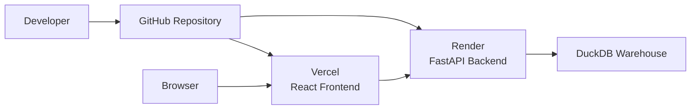

# Deployment Guide

## Overview

The Restaurant POS Analytics Dashboard is deployed as two independent services:

- **Frontend** – React application hosted on **Vercel**
- **Backend** – FastAPI application hosted on **Render**
- **Database** – DuckDB analytical warehouse

This separation allows the frontend and backend to be deployed, updated, and scaled independently while communicating through REST APIs.

---

# Deployment Architecture



---

# Deployment Components

| Component | Technology | Platform |
|------------|------------|----------|
| Frontend | React + Vite | Vercel |
| Backend | FastAPI | Render |
| Database | DuckDB | Hosted with Backend |
| Version Control | Git | GitHub |

---

# Environment Configuration

The project uses environment variables to separate configuration from source code.

## Backend

Typical backend variables include:

```env
DATABASE_PATH=../synthetic_data/restaurant_pos_synthetic.duckdb

HOST=0.0.0.0

PORT=8000

APP_ENV=production
```

The backend reads these values during application startup.

Changing the database path requires **no code changes**.

---

## Frontend

Typical frontend configuration:

```env
VITE_API_BASE_URL=https://your-render-service.onrender.com
```

All frontend API requests are routed through this base URL.

---

# Backend Deployment

The FastAPI backend is deployed independently.

Deployment process:

1. Push source code to GitHub.
2. Render pulls the latest commit.
3. Python dependencies are installed.
4. Environment variables are loaded.
5. DuckDB database is opened.
6. FastAPI starts with Uvicorn.
7. API becomes publicly accessible.

The backend maintains a read-only DuckDB connection throughout its lifetime.

---

# Frontend Deployment

The React application is deployed separately.

Deployment process:

1. Push changes to GitHub.
2. Vercel automatically detects updates.
3. Vite builds the production bundle.
4. Static assets are deployed.
5. Frontend becomes available globally.

No backend code is bundled into the frontend.

---

# DuckDB Deployment

The backend connects directly to a DuckDB warehouse.

```mermaid
flowchart TD

FastAPI

↓

Analytics Service

↓

DuckDB Connection

↓

DuckDB Warehouse
```

The database is opened during application startup and reused throughout the application's lifetime.

---

# Synthetic Database

The public deployment uses a schema-compatible synthetic DuckDB warehouse.

Advantages include:

- No confidential business data
- Same schema as production
- Same API behaviour
- Safe public demonstration
- Easy reproducibility

The synthetic database is generated using:

```
synthetic_data/create_synthetic_database.py
```

---

# Switching Databases

The application can switch between different warehouses using only the environment configuration.

```
Production Warehouse

↓

DATABASE_PATH

↓

Synthetic Warehouse
```

Because both warehouses share the same schema, the application requires no code modifications.

---

# Deployment Workflow

```mermaid
flowchart LR

Code

-->

GitHub

-->

Render Build

-->

Backend

-->

DuckDB

-->

REST API

-->

Vercel

-->

Browser
```

---

# CORS Configuration

The backend is configured to accept requests from the deployed frontend.

The configuration allows:

- Local development
- Production frontend
- Vercel preview deployments

This enables seamless communication between independently deployed services.

---

# Deployment Verification

After deployment, verify the following:

## Backend

- Application starts successfully
- DuckDB connection established
- `/health` returns HTTP 200
- Swagger documentation loads
- Analytics endpoints return data

---

## Frontend

- Dashboard loads successfully
- KPI cards populate correctly
- Charts render correctly
- Filters update all dashboard components
- Responsive layout functions correctly

---

# Production Checklist

Before releasing a new version:

- Backend builds successfully
- Frontend builds successfully
- Environment variables configured
- DuckDB database accessible
- API endpoints tested
- Dashboard interactions verified
- Mobile layout verified
- Browser compatibility checked

---

# Troubleshooting

## Backend cannot connect to DuckDB

Possible causes:

- Incorrect `DATABASE_PATH`
- Missing database file
- Invalid database file
- File permission issues

---

## Frontend cannot reach backend

Possible causes:

- Incorrect `VITE_API_BASE_URL`
- Backend unavailable
- CORS configuration
- Network connectivity

---

## Empty dashboard

Possible causes:

- Database contains no data
- API unavailable
- Incorrect filter selection
- Backend query failure

---

# Design Decisions

## Why Separate Frontend and Backend?

Independent deployments simplify development, maintenance, and future scaling while keeping responsibilities clearly separated.

---

## Why Environment Variables?

Configuration differs between local development and production.

Environment variables allow deployment without modifying source code.

---

## Why Synthetic Data?

The deployed application demonstrates complete functionality while protecting confidential restaurant business data.

The synthetic warehouse preserves schema compatibility, ensuring the same application code can operate against either synthetic or production datasets.