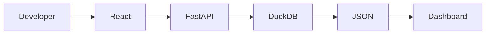

# Local Development Setup

## Overview

This guide explains how to set up and run the Restaurant POS Analytics Dashboard in a local development environment.

The application consists of three major components:

- React Frontend
- FastAPI Backend
- DuckDB Analytical Warehouse

Each component can be started independently during development.

---

# System Requirements

Before starting, ensure the following software is installed.

| Software | Recommended Version |
|------------|--------------------|
| Python | 3.11 or newer |
| Node.js | 18 or newer |
| npm | Latest |
| Git | Latest |

Verify installation:

```bash
python --version

node --version

npm --version

git --version
```

---

# Project Structure

```
Task_2/

├── backend/
├── frontend/
├── synthetic_data/
├── docs/
├── scripts/
├── README.md
└── assignment.md
```

---

# Clone Repository

```bash
git clone <repository-url>

cd Task_2
```

---

# Backend Setup

## Step 1

Navigate to the backend.

```bash
cd backend
```

---

## Step 2

Create a virtual environment.

macOS / Linux

```bash
python3 -m venv .venv
```

Windows

```bash
python -m venv .venv
```

---

## Step 3

Activate the virtual environment.

macOS / Linux

```bash
source .venv/bin/activate
```

Windows

```bash
.venv\Scripts\activate
```

---

## Step 4

Install dependencies.

```bash
pip install -r requirements.txt
```

---

## Step 5

Create environment variables.

```bash
cp .env.example .env
```

Example

```env
DATABASE_PATH=../synthetic_data/restaurant_pos_synthetic.duckdb

HOST=0.0.0.0

PORT=8000

APP_ENV=development
```

---

## Step 6

Run the backend.

```bash
uvicorn app.main:app --reload
```

Backend URL

```
http://localhost:8000
```

Swagger Documentation

```
http://localhost:8000/docs
```

Health Endpoint

```
http://localhost:8000/health
```

---

# Frontend Setup

## Step 1

Open a new terminal.

Navigate to the frontend.

```bash
cd frontend
```

---

## Step 2

Install dependencies.

```bash
npm install
```

---

## Step 3

Create environment variables.

```bash
cp .env.example .env
```

Example

```env
VITE_API_BASE_URL=http://localhost:8000
```

---

## Step 4

Start the development server.

```bash
npm run dev
```

Frontend URL

```
http://localhost:5173
```

---

# Running the Complete Application

Start the backend.

```bash
cd backend

source .venv/bin/activate

uvicorn app.main:app --reload
```

Open another terminal.

Start the frontend.

```bash
cd frontend

npm run dev
```

Open

```
http://localhost:5173
```

---

# Development Workflow



Typical workflow:

1. Start the backend.
2. Start the frontend.
3. Open the dashboard.
4. Modify code.
5. Save changes.
6. Hot reload updates the application.

---

# Using the Synthetic Database

The repository includes a schema-compatible synthetic warehouse.

Location

```
synthetic_data/

restaurant_pos_synthetic.duckdb
```

If the database needs to be regenerated:

```bash
python synthetic_data/create_synthetic_database.py synthetic_data/restaurant_pos_synthetic.duckdb
```

No application code changes are required after regeneration.

---

# Common Commands

## Backend

Install packages

```bash
pip install -r requirements.txt
```

Run server

```bash
uvicorn app.main:app --reload
```

---

## Frontend

Install packages

```bash
npm install
```

Run development server

```bash
npm run dev
```

Production build

```bash
npm run build
```

Preview production build

```bash
npm run preview
```

---

# Troubleshooting

## Backend fails to start

Possible causes

- Virtual environment not activated
- Missing dependencies
- Incorrect DATABASE_PATH
- Invalid DuckDB file

---

## Frontend cannot connect to backend

Check

- Backend is running
- Correct `VITE_API_BASE_URL`
- CORS configuration
- Network connectivity

---

## Dashboard displays no data

Verify

- DuckDB database exists
- Backend API is reachable
- Analytics endpoints return data
- Filters are valid

---

## Swagger unavailable

Verify

- Backend is running
- Correct backend port
- FastAPI startup completed successfully

---

# Verification Checklist

Before development begins, confirm:

- Python installed
- Node.js installed
- Dependencies installed
- Virtual environment activated
- DuckDB database available
- Backend running
- Frontend running
- Swagger accessible
- Dashboard loads successfully
- Charts display correctly
- Filters update analytics

---

# Useful URLs

| Service | URL |
|----------|-----|
| Frontend | http://localhost:5173 |
| Backend | http://localhost:8000 |
| Swagger | http://localhost:8000/docs |
| Health Check | http://localhost:8000/health |

---

# Additional Notes

- The backend operates as a read-only analytics service.
- The frontend never communicates directly with DuckDB.
- All dashboard data is retrieved through the FastAPI REST API.
- Configuration is managed through environment variables, allowing the same codebase to be used across local development and production deployments.
- The synthetic DuckDB database enables safe public demonstrations while maintaining compatibility with the production warehouse schema.